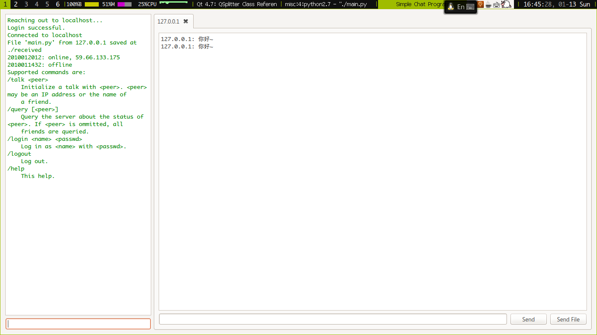

A useless chat program in PyQt4. My project of Computer Networking and
Application course.

Looks like this:

# License

BSD 2-clause, see LICENSE for a copy.

In short, this means you may do anything with my code as long as I am
attributed, and I won't take any responsibility for what you have done.
